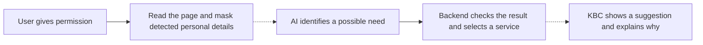

# KBC Assist

[DEMO](kbc.46.224.58.19.sslip.io)
(token needed for demo: b1f692aff0ad57a3ab1f88bb6341ac7f1e02a68e664f8017c3ec91d4f4276607)

https://github.com/user-attachments/assets/0c5cc1c8-c012-4af5-ad50-01db45582154


**Banking help based on what you are doing, with your permission.**

KBC Assist helps customers find a banking service when it could be useful. Our demo follows someone shopping for an electric car. After they enable Assist, a KBC notification suggests a car loan. They can open the offer, see why it was suggested, or carry on browsing.

The idea is to make useful services easier to discover while leaving the decision with the customer. Assist asks for permission first and lets them pause suggestions or delete the information behind them.

## Try the demo in five steps

The page shows the KBC banking app and a partner car marketplace side by side. The car-shopping example uses sample activity.

1. **Enable Assist.** Accept the opening prompt or turn it on in the Context tab.
2. **Explore the car page.** View the electric car and try the sample order form. The suggestion is triggered by enabling Assist, rather than tracking these interactions.
3. **Open the notification.** A KBC message appears over the marketplace. Click it to go to the Context tab.
4. **Explore the suggestion.** Preview the car loan, choose “Why am I seeing this?”, or open “Explore context” to inspect the information used.
5. **Stay in control.** Dismiss the suggestion, pause Assist, or delete context. The sample context expires after 15 minutes; reload to reset the demo.

No loan application or car order is submitted.

## What happens behind the scenes

The full design starts with permission to read a selected browser tab. Text is read locally, and detected personal details are covered before any information is sent for AI analysis. AI identifies the possible need; the backend checks the result and matches it to a service in the demo catalogue.



Dashed arrows show the connections still needed for the live flow. The main demo currently uses sample data for its suggestions.

## What we have built

| Part                           | Current state                                                                                                                                                                                    |
| ------------------------------ | ------------------------------------------------------------------------------------------------------------------------------------------------------------------------------------------------ |
| Banking and marketplace demo   | Clickable screens with consent, notifications, a car-loan preview, explanations, and privacy controls. Suggestions use sample data.                                                              |
| Local capture and privacy code | Browser-tab capture, local text recognition, and detection through Rust/Interdict. The browser masks detected sensitive text in a local preview. This is separate from the main suggestion flow. |
| Intent and service backend     | Temporary sessions, input checks, AI integration through Xpiki, and catalogue matching for car-buying and home-buying needs. Live analysis requires an API key.                                  |

The next step is to connect the local privacy output to the live recommendation flow. Detection can miss personal information, so the prototype uses synthetic examples. It does not connect to real KBC accounts or make lending decisions.

## How it answers the KBC challenge

- **Understand:** use recent activity to recognise a possible need, such as buying a car.
- **Adapt:** offer a useful next step and explain why it appeared.
- **Scale:** extend the same approach to other needs, such as buying a home, by adding supported needs and services. The car-shopping demo illustrates this idea.

## Run locally

Requires Node.js 22+ and Docker Compose. From the repository root:

```sh
node scripts/setup-local.mjs
docker compose up --build -d
```

Open [localhost:5173](http://localhost:5173). The sample demo needs no AI account. Stop with `docker compose down`.

[Setup details](docs/docker.md) · [API contract](docs/integration.md) · [Frontend integration](web/INTEGRATION.md) · [License](LICENSE)
