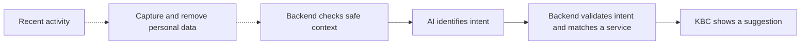

# KBC Assist

A banking demo that turns recent activity into a relevant KBC service suggestion.

## Workflow

1. **Enable context.** Accept the opening prompt or turn on Assist in the Context tab.
2. **Browse the marketplace.** View the car listing or try the order form. The demo generates sample car-shopping context after consent.
3. **Get a suggestion.** A KBC notification appears over the marketplace. Click it to open the Context tab.
4. **Explore the offer.** Preview the car loan, see why it was suggested, or inspect the context summary. No loan application or car order is submitted.
5. **Stay in control.** Dismiss the suggestion, pause Assist, or delete context. Demo context expires after 15 minutes; reloading resets the demo.

## Behind the scenes

The full pipeline is shown below. Today the UI uses sample data. Capture, OCR/masking, and the live frontend connection are still pending (dashed arrows). The backend currently supports home-buying intent; the car-loan example is simulated.



## Run locally

Requires Node.js 22+ and Docker Compose.

```sh
node scripts/setup-local.mjs
docker compose up --build -d
```

Open [localhost:5173](http://localhost:5173). Stop with `docker compose down`.

More details: [Docker setup](docs/docker.md) · [API contract](docs/integration.md) · [License](LICENSE).
