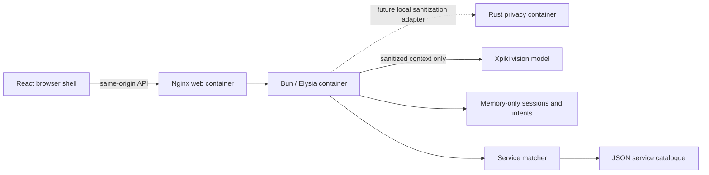

# Component map

| Piece              | Location / boundary                     | Status                                            |
| ------------------ | --------------------------------------- | ------------------------------------------------- |
| 1. Activity page   | `web/src/features/activity/`            | Frontend partner marketplace and local order form |
| 2. Consent         | `web/src/features/consent/`             | Owner integration pending                         |
| 3. Capture         | Browser host API                        | Owner integration pending                         |
| 4. OCR             | Local browser worker or privacy adapter | Owner integration pending                         |
| 5. Privacy         | `services/privacy/`                     | Transport scaffold only; returns 503              |
| 6. Context builder | `src/context/`                          | Existing implementation preserved                 |
| 7. Intent AI       | `src/intent/`                           | Existing implementation preserved                 |
| 8. Session/context | `src/session/`, `src/context/store.ts`  | Implemented; memory-only lifecycle and expiry     |
| 9. Catalogue       | `src/catalogue/`, `kbc-services.json`   | Implemented; matches against mock catalogue       |
| 10. Notifications  | `web/src/features/notifications/`       | Owner integration pending                         |
| 11. KBC UI         | `web/src/features/assistant/`           | Frontend demo; fixture context, live API pending  |

`compose.yaml` runs the web shell, Bun API, and Rust privacy boundary as one stack.

The current frontend renders independent KBC and partner marketplace frames. KBC Assist lives in the Context tab and uses `web/src/data/contextFixture.ts`; it makes no API requests. The fixture represents the UI display model, not a second backend contract. Future integration should adapt the existing authenticated context/intent response documented in `docs/integration.md` to that display model. Marketplace form data stays in React memory and is neither transmitted nor redacted.

- Browser capture remains on the host in the user's browser; Docker cannot capture the user's screen itself.
- One Compose stack, three containers. A Rust crate is a Rust package, not the deployment unit for the whole project.
- Only the web port is published, bound to host loopback. Backend credentials never reach frontend builds.
- Rust's network is internal and its scaffold never sends raw content onward.
- The existing sanitized-input endpoint remains the integration seam; the scaffold does not invent a second privacy pipeline.
