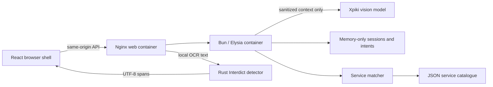

# Component map

| Piece              | Location / boundary                             | Status                                        |
| ------------------ | ----------------------------------------------- | --------------------------------------------- |
| 1. Activity page   | web/src/features/activity/                      | Integrated local preview                      |
| 2. Consent         | web/src/features/activity/                      | Explicit tab capture consent                  |
| 3. Capture         | web/src/features/capture/                       | Tab capture and synthetic fixture             |
| 4. OCR             | web/src/features/ocr/                           | Local Tesseract worker and WASM               |
| 5. Privacy         | services/privacy/ and web/src/features/privacy/ | Interdict detection and browser masking       |
| 6. Context builder | `src/context/`                                  | Existing implementation preserved             |
| 7. Intent AI       | `src/intent/`                                   | Existing implementation preserved             |
| 8. Session/context | `src/session/`, `src/context/store.ts`          | Implemented; memory-only lifecycle and expiry |
| 9. Catalogue       | `src/catalogue/`, `kbc-services.json`           | Implemented; matches against mock catalogue   |
| 10. Notifications  | `web/src/features/notifications/`               | Owner integration pending                     |
| 11. KBC UI         | `web/src/features/assistant/`                   | Owner integration pending                     |

`compose.yaml` runs the web shell, Bun API, and Rust privacy boundary as one stack.

- Browser capture remains on the host in the user's browser; Docker cannot capture the user's screen itself.
- One Compose stack, three containers. A Rust crate is a Rust package, not the deployment unit for the whole project.
- Only the web port is published, bound to host loopback. Backend credentials never reach frontend builds.
- Rust's network is internal; the web proxy forwards local inspection requests without persistence.
- The existing sanitized-input endpoint remains the integration seam; the local-preview UI does not yet submit SanitizedInput.
